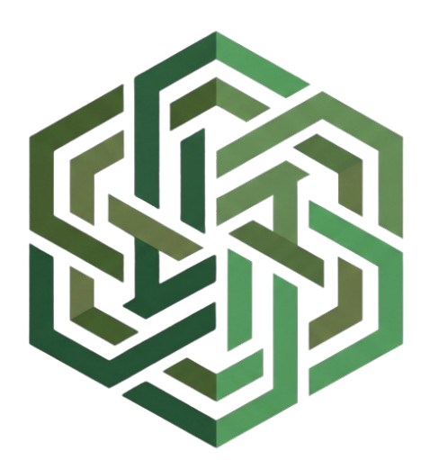

  
  <h3 style="border-bottom: none; margin-bottom: 0;">CANOPY CORP</h3>
  
Advanced Systems Architecture & High-Performance Computing

---

### 🌐 Overview
Canopy Corp operates as a specialized systems engineering and research entity dedicated to next-generation computing architectures. We design, benchmark, and deploy highly optimized, fault-tolerant frameworks that interface complex analytical pipelines directly with accelerated hardware layers. 

### 🔬 Core Frameworks & R&D
* **High-Performance Vision Pipelines:** Specializing in advanced spatial mapping, generative adversarial networks (GANs), and synthetic dataset generation for sub-aquatic environmental monitoring and anomaly detection.
* **Low-Latency Hardware Acceleration:** Micro-architecting event-driven temporal networks (SNNs) implemented via system-on-chip (SoC) field-programmable gate arrays to bypass standard processing bottlenecks.
* **Kernel-Level Security Architectures:** Blueprinting AI-native, zero-trust execution environments utilizing eBPF and low-level systems logic to guarantee execution integrity.

### ⚙️ Technical Stack
* **Low-Level & Runtime:** C++, eBPF, Hardened Linux Kernels, Wayland
* **Analytics & Modeling:** Python, YOLO Architectures, Custom Mathematical Modeling
* **Hardware Synthesis:** Verilog, SoC FPGA Target Platforms, Discrete Logic Emulation

---

  <i>"Engineered Layer Integrity."</i> 

